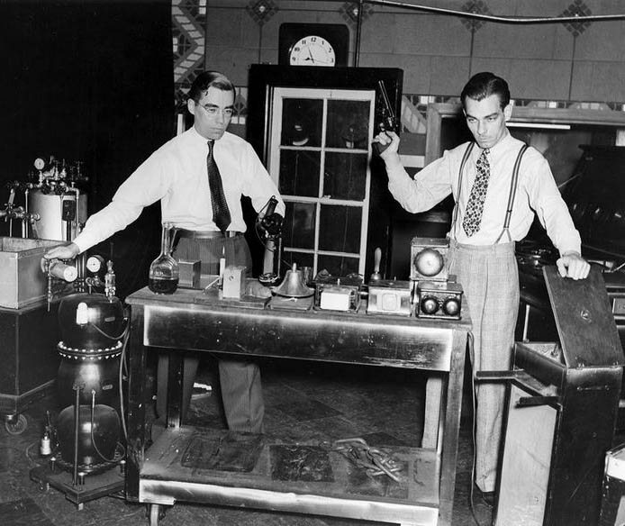

+++
title = "Character"
outputs = ["Reveal"]
[reveal_hugo]
theme = "moon"
margin = 0.2
separator = "##"
+++

# Character Psychology And Acting With Sound

{}
To allow the viewer to associate themselves with a character sound is a necessary component. Before a foley artist can perform character, they must get to know the character, to embody it.

- Main character - protagonist
- obstacle - antagonist
  - bad characters

{}

---

# Antagonist examples

{}

Sound plays a major role in moving the story along by showing the characters relationship to the conflict, using feelings desires, or relationships to other characters.
{}

---

### Settings - Hotel from the Shinning

<iframe width="560" height="315" src="https://www.youtube.com/embed/CUnX0w2PRS0" title="YouTube video player" frameborder="0" allow="accelerometer; autoplay; clipboard-write; encrypted-media; gyroscope; picture-in-picture" allowfullscreen></iframe>

---

### Non-human entities - The Fog

<iframe width="560" height="315" src="https://www.youtube.com/embed/nOZwnivtLbc" title="YouTube video player" frameborder="0" allow="accelerometer; autoplay; clipboard-write; encrypted-media; gyroscope; picture-in-picture" allowfullscreen></iframe>

---

### Internal force within the protagonist - Jekyll and Hyde

<iframe width="560" height="315" src="https://www.youtube.com/embed/4kmeixKc9yk" title="YouTube video player" frameborder="0" allow="accelerometer; autoplay; clipboard-write; encrypted-media; gyroscope; picture-in-picture" allowfullscreen></iframe>

---

**Activity A** - how does the character develop through the timeline: desires, motivations, obstacles? How does the character change?

---

# Acting with sound

{}

A sound designer can translate character into sound through Foley. Through the use of Foley we can inhabit a character and act out their movements.
{}

---

# Foley: history of a craft

---

#### Foley in the US: Jack Foley

{}
Jack Foley was a New Yorker of Irish descent, who grew up on Long Island.

Thus, when Universal needed to add sound to Showboat (1929), Jack was one of those who seized the opportunity to pitch in and help solve the latest problem brought on by this new technology—or opportunity, depending on one’s perspective.

When The Jazz Singer (1927) was released, Warner Brothers recorded small segments of sound for Al Jolson’s improvisational singing per- formance while leaving the rest of the film as a silent production.
{}

---

<iframe width="560" height="315" src="https://www.youtube.com/embed/zgWWZlv6FqU" title="YouTube video player" frameborder="0" allow="accelerometer; autoplay; clipboard-write; encrypted-media; gyroscope; picture-in-picture" allowfullscreen></iframe>

---

## Practical Foley design

- Catagories of Foley:
  - moves or cloth;
  - footsteps
  - specifics, spots or props

{}
Foley is recorded in layers in a Digital Audio Workstation, such as Reaper. This old technique is still used today because digital replacement systems can't match the level of realism granted by a human performance.

{}

---

## Moves

- Cloth track - movement sound of clothing

<iframe width="560" height="315" src="https://www.youtube.com/embed/-SUcALp4avE" title="YouTube video player" frameborder="0" allow="accelerometer; autoplay; clipboard-write; encrypted-media; gyroscope; picture-in-picture" allowfullscreen></iframe>

{}
This helps bring the image to life, build a sense of intimacy with characters and smooth over joins in the dialogue edit.

The audience should not notice these tracks, however if removed the audience would notice a loss of realism.

Lots of editing is necessary to create moves that are well synced. Any stray sounds where there is no-screen movement must be removed, otherwise the illusion of the foley attaching to the image may be broken.

Moves are often the first pass of a Foley artist doing all of one character through a whole movie so no prop changes are needed.

cotton and denim tend to work well, whereas synthetic fibres can sound a bit thin, or have a scratchy quality, peppered with little click-like sounds.
{}

---

## Steps

<iframe width="560" height="315" src="https://www.youtube.com/embed/eobm9HzVnvI" title="YouTube video player" frameborder="0" allow="accelerometer; autoplay; clipboard-write; encrypted-media; gyroscope; picture-in-picture" allowfullscreen></iframe>

{}
Steps then further define a character. A person's shoes say a lot about their personality. Also, how the person walks can tell you their mood and inner feeling.

Wearing shoes carefully selected for their sound, artists employ a heel-toe technique that creates two distinct sounds for each step, often with an added slide or shuffle as a character comes to a stop.

Importantly, artists must wear very soft clothes, usually cotton, to minimize unwanted noise as they perform.
{}

---

## Specifics - spots

<iframe width="560" height="315" src="https://www.youtube.com/embed/WnozP8OWeik" title="YouTube video player" frameborder="0" allow="accelerometer; autoplay; clipboard-write; encrypted-media; gyroscope; picture-in-picture" allowfullscreen></iframe>

{}

Any actor interaction that falls outside moves or steps is filed under the category of specifics, or spots.
{}
