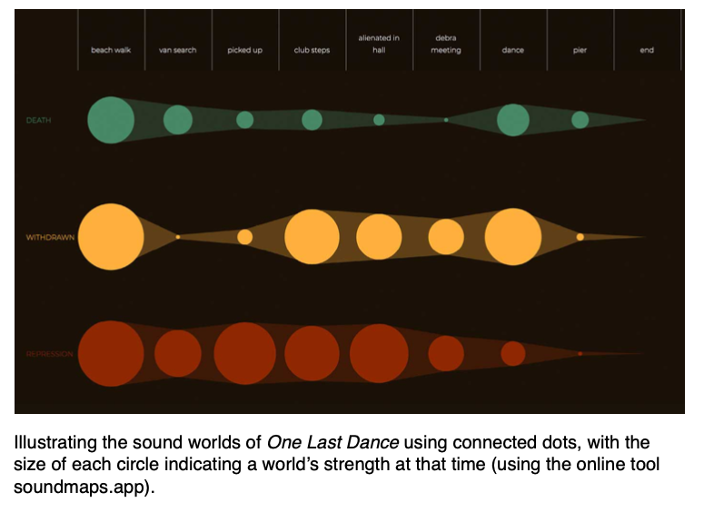
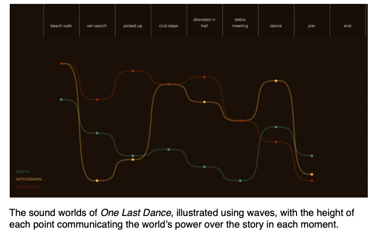

+++
title = "Shape: Sound Maps, Contrast And Motif"
outputs = ["Reveal"]
[reveal_hugo]
theme = "blood"
# show_notes = "separate-page"
+++

# Shape

## Sound Maps, Contrast And Motif

{}
So far we have largely looked at elements in isolation, but we also need to be in control of how things connect through time – the shifts and evolutions of ideas, themes and feelings that guide an audience through a story. In this chapter we will be exploring these temporal dynamics through the lens of shape.

To do this we'll look at story and narrative.

- Story - events that happen to the characters within the film world
- Narrative - the way in which those events are portrayed – the telling of the story.

{}

---

[Stories diagram](stories.jpeg)

{}
We can use these ideas of story arc and narrative to shape our sound design decisions. We can try to answer the questions: Which world is the focus of each scene? Are there shifts that happen within scenes? And which world ends up on top?
{}

---

## Mapping the script

---

{}
Can we do this with a story that we all know? If we have this map it can become more clear when to use what sound world and what its effect will be.
{}

---

## Connecting time - narrative

- motif
- foreshadowing
- contrast

{}
Sound also offers some powerful devices for performing narrative operations on a timeline. By using rhythms of variation and similarity to make or break connections, it is possible to move moments together or apart in terms of meaning and emotion. Motif, foreshadowing and contrast are three such tools.
{}

---

## Motif

{}
Sound motif - recurring sonic symbol that weaves its way through a timeline.

Form an initial meaning of a sound then introduce that sound throughout the film to echo the meaning. This echoing of meaning can help to tie parts of the story together.

{}

---

<iframe width="560" height="315" src="https://www.youtube.com/embed/vIux68hUlgY" title="YouTube video player" frameborder="0" allow="accelerometer; autoplay; clipboard-write; encrypted-media; gyroscope; picture-in-picture" allowfullscreen></iframe>

{}
In A Man Escaped, the striking of a bell is associated with the attempt of a prisoner to escape his captors. In this case, it recalls the bell of a tram that he tries to board, before being recaptured. Throughout the rest of the film, we hear the same chime whenever the idea of escape is in the character’s mind, a continual reminder of his desire for freedom. And whilst the meaning is always an echo of the original escape, each refrain feels different, responding to what the character, and audience, have experienced since. In this way we can think of motif as a tool of development, as much as retrospection – each repetition brings a new chance for interpretation and reflection on how things have changed.
{}

---

<iframe width="560" height="315" src="https://www.youtube.com/embed/pMy3zvY7IFU" title="YouTube video player" frameborder="0" allow="accelerometer; autoplay; clipboard-write; encrypted-media; gyroscope; picture-in-picture" allowfullscreen></iframe>

{}
A good video essay on other aspects of sound in the film.

There is another example of a key motive in the anime Akira, but I couldn't find the scene.
{}

---

## Lady Macbeth - magpie call

- [Amazon](https://www.amazon.com/gp/video/detail/0IVB2IGFR21RK6O4AZ2TISK9PF)
  - 11:10 - 11:29

{}
Symbolizes her escape from her trapped inside existence
{}

---

## The Empire Strikes Back - Vadar's breath

<iframe width="560" height="315" src="https://www.youtube.com/embed/aV2DLkDPwM8" title="YouTube video player" frameborder="0" allow="accelerometer; autoplay; clipboard-write; encrypted-media; gyroscope; picture-in-picture" allowfullscreen></iframe>

---

## Hot Fuzz - Foreshadowing

<iframe width="560" height="315" src="https://www.youtube.com/embed/ds4NV7kZpYs" title="YouTube video player" frameborder="0" allow="accelerometer; autoplay; clipboard-write; encrypted-media; gyroscope; picture-in-picture" allowfullscreen></iframe>

{}
Dialogue is often used to foreshadow plot points, for either dramatic or comic effect. Hot Fuzz uses this device to set up a twist at the village fête, pre-empting a gruesome sight gag with a piece of wordplay. A troublesome reporter’s name is drawn in a raffle, with the announcement ‘Tim, your number’s up!’ drawing maniacal laughter from the crowd. As ominous music builds, the clock strikes three and the fate of the journalist is sealed in violently absurd fashion.
{}

---

## Indiana Jones

<iframe width="560" height="315" src="https://www.youtube.com/embed/ClwIj3x24Q4" title="YouTube video player" frameborder="0" allow="accelerometer; autoplay; clipboard-write; encrypted-media; gyroscope; picture-in-picture" allowfullscreen></iframe>

{}
Why did it have to be snakes?
{}

---

## American Horror Story - Subtle foreshadowing

<iframe width="560" height="315" src="https://www.youtube.com/embed/AiDOBDEbdCM" title="YouTube video player" frameborder="0" allow="accelerometer; autoplay; clipboard-write; encrypted-media; gyroscope; picture-in-picture" allowfullscreen></iframe>

---

## Contrast and turning points

<iframe width="560" height="315" src="https://www.youtube.com/embed/6Lnb1bI0VIk" title="YouTube video player" frameborder="0" allow="accelerometer; autoplay; clipboard-write; encrypted-media; gyroscope; picture-in-picture" allowfullscreen></iframe>

{}
If we want to pull narrative elements apart, instead of connecting them, we can make use of contrast – in order to say something strongly, making the opposite point immediately before is a way to underline the intended meaning.

In the opening to Ivan’s Childhood, for example, a dreamy sequence sees Ivan playing in a forest, amidst the sound of cuckoos and a romantic score. Suddenly he awakes, and we are thrust into his reality as a war-time spy, in a world filled with gunfire and ominous music. The sharp contrast between these two sequences communicates the gap between what we feel childhood should be about, and the character’s actual situation. By first showing us the idealized dream, the reality is all the more shocking.
{}

---

## The Sound of Metal

[Amazon](https://www.amazon.com/gp/video/detail/0OWOY28NCAYY94VCM9FFFXRKS1)

{}
Beginning scene - contrast between metal set and the quiet of the RV
{}
